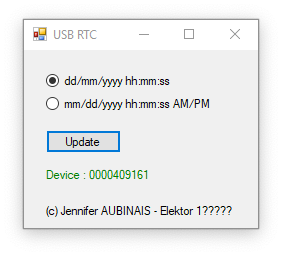

# USB/RTC for Raspberry PI

The Raspberry Pi is able to synchronize time via internet or with a small card connected to its pins. This project is a USB key with a clock circuit that keeps the time of your Raspberry Pi. The project describes the necessary updates and the program in Python 3 to set the time at startup and anytime you want.

# Finish (10/04/2019)

Project Elektor Magazine
(will be published in late 2019)

Elektor Labs (schematic): https://www.elektormagazine.fr/labs/usbrtc-for-raspberry-pi

The USB KEY

contact : [Jennifer AUBINAIS](mailto:jennifer@aubinais.net) 

# Installation Raspberry Pi:

- copy [install.sh](https://github.com/jenniferaubinais/USB_RTC/blob/master/RaspberryPi/install.sh) to your Raspberry Pi (/home/pi/)
- sudo chmod 777 install.sh
- sudo ./install.sh
 
# Installation PC:

- copy mcp2221_JA.dll
- copy UpdateUSBRTC.exe
- connect the USB RTC key
- launch UpdateUSBRTC.exe
